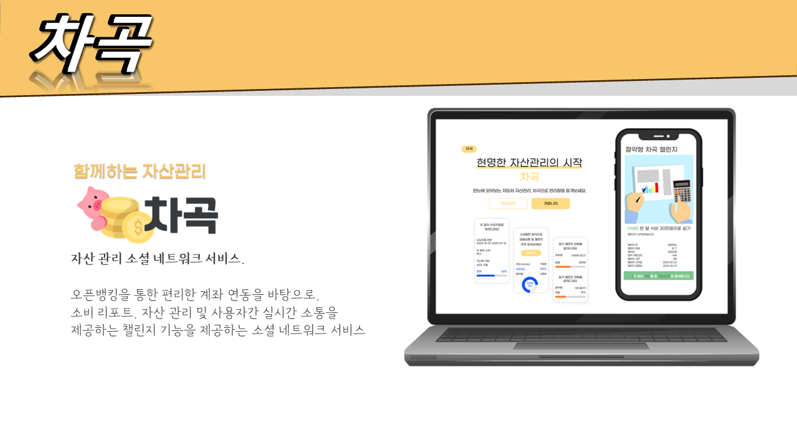
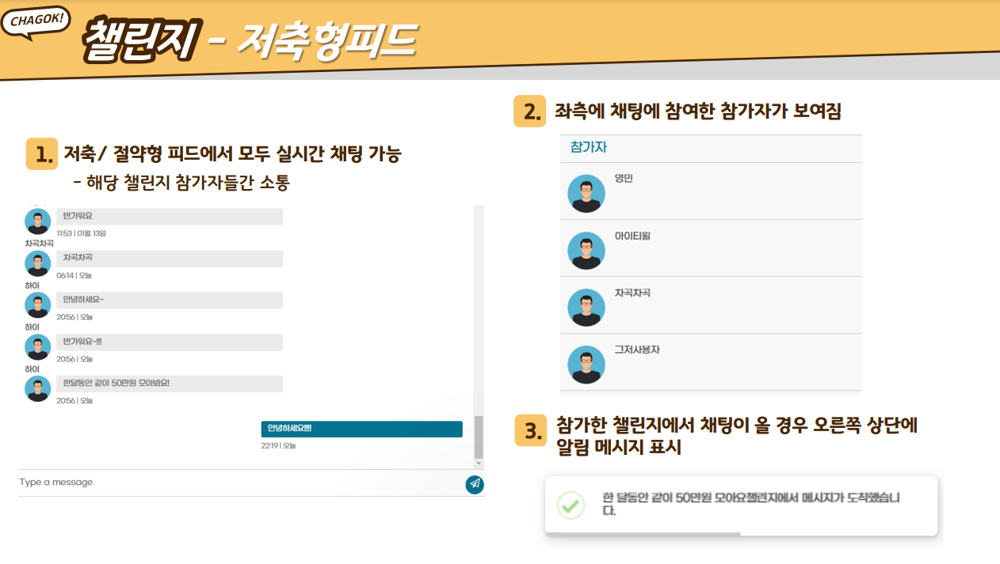
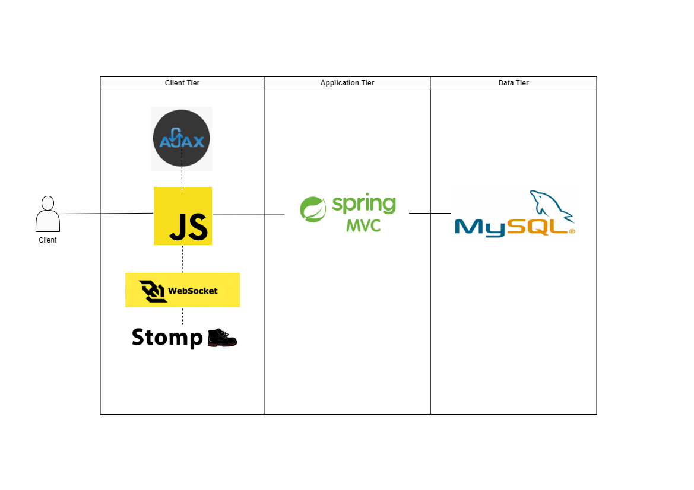
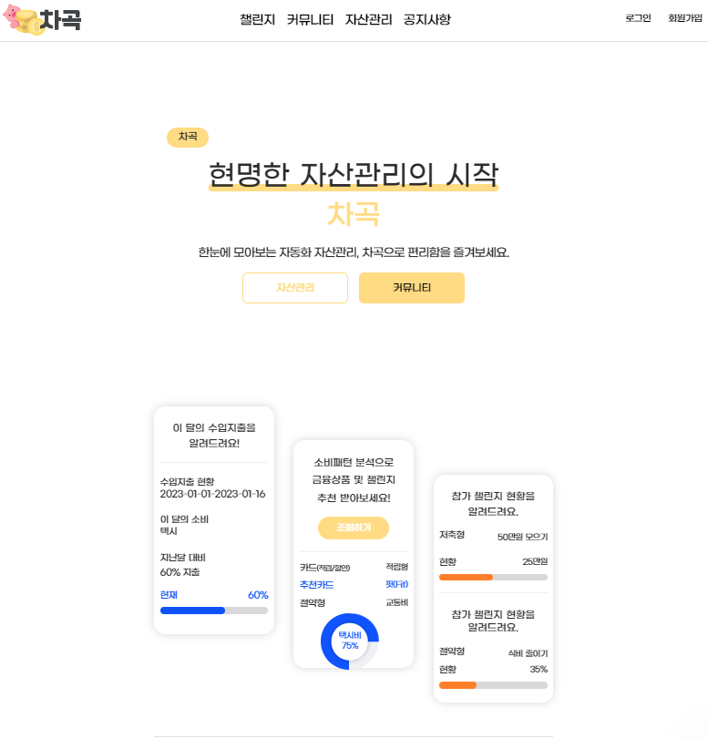
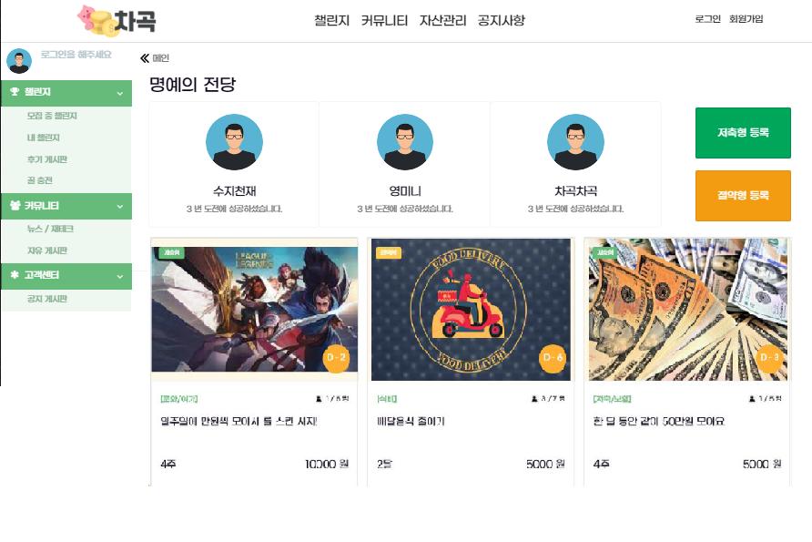

# 💸차곡
- 자산관리 소셜 네트워크 서비스

> **제작의도**

**소통**과 **공유**로 **가치 성장을 추구**하는 MZ세대의 특성을 반영하여
**함께하는 자산관리 서비스**를 제작하게 되었습니다.

## ✔️ 프로젝트 소개
> **기능**

- 소비습관 형성에 도움을 주는 다양한 **챌린지**
- 챌린지 기간 동안 참가자들간의 **실시간 채팅** 기능
- 금융API를 토대로 오픈뱅킹을 이용하여 **계좌정보 연동**
- 소비내역을 통한 **소비리포트**, 자산 내역 조회

> **맡은 기능**
- 참가자들간의 실시간 채팅 기능

- Websocket, STOMP(Simple Text Oriented Messaging Protocol)을 사용하여 실시간 단체 채팅구현.

> Websocket

실시간으로 메시지를 보내고 받기 위해서 사용하게 되었습니다.

통상적인 HTTP 통신의 경우, client가 요청을 보내는 경우에만 Server가 응답하는 단방향 통신이지만,
웹소켓은 Handshake요청을 통해 양방향 통신이 가능하여 서버와의 실시간 데이터 전송을 용이하게 합니다.

> STOMP(Simple Text Oriented Messaging Protocol)

단체 채팅을 구현하기 위해 사용되었습니다.

pub/sub 구조로 되어있어 메시지를 전송하고 메시지를 받아 처리하는 부분이 확실히 정해져있고,
websocket위에 동작하는 프로토콜로써 클라이언트와 서버가 전송할 메시지의 유형, 형식, 내용들을 정의하는 메커니즘입니다.

## ✔️ 아키텍처

## ✔️ 부족했던 점
외부 메시지 브로커없이 사용자를 서버에 기억하여 알림 메시지를 처리하려고 했던 것이 아쉬웠던 설계라고 생각합니다.

**챌린지 번호**를 사용하여 챌린지 개설 시 **자동적으로** 채팅방을 **생성**되도록 하였습니다. 사이트 접속 시에 **어디서나 알림**을 받을 수 있게 구현하기 위해 웹소켓 세션을 따로 서버에 저장해두고 해당 사용자가 로그인된 상태에서만 알림이 가도록 처리하려고 했습니다.  

구현단계에서 해당 방식으로 구현할 수 없음을 깨닫게 되었습니다. 웹소켓 세션에 대한 명확한 이해가 부족했던 상황에서 설계한 방식이었기 때문이었습니다. 

마감이 일주일정도 남은 시점에서 새롭게 외부메시지브로커를 공부해서 구현까지하기는 어렵다고 판단하였습니다. 그렇기에 채널의 번호를 가지고 있는 사용자(채널구독하고 있는 사용자)에게만 알림을 전송하도록 처리하고 마무리하였습니다.

기회가 된다면 **외부 메시지 브로커**를 사용하여 사용자가 어떤 서버에 접속하고 있는지를 기억하여 웹소켓이 다른 서버에 접속하였더라도 구독 중인 채널의 메시지를 받을 수 있도록 기능을 추가하고 싶습니다.

# 🔗 프로젝트 주소
[차곡](http://chagok.ga/main)

